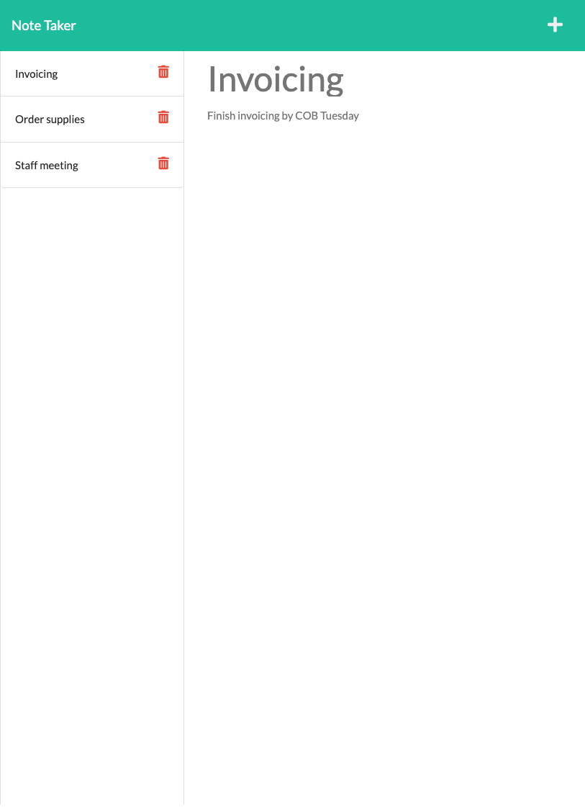

# Note Taker

## Description

A note taking application designed to assist users with a busy schedule.

Create new notes easily and access them wherever you go.

[Live site](https://brad-teague-note-taker.herokuapp.com)

[Github repository](https://github.com/bradbrad88/note-taker)

## License

Project license: [ISC](https://opensource.org/licenses/ISC). Copyright Brad Teague 2022

## Questions

For any questions about the project, please raise an issue at [this issues page](https://github.com/bradbrad88/note-taker/issues).

For any further questions you can contact me [here](b_rad88@live.com).
